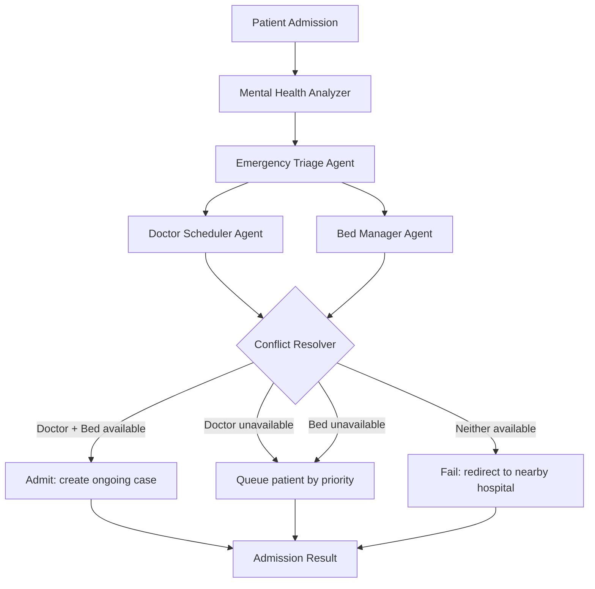

# SHMAS: Smart Hospital Multi-Agent AI System

**Second Place Winner, Luddy Hackathon**

---

## Inspiration

In the fast-paced world of healthcare, even the smallest delays in hospital operations can have life-or-death consequences. With multiple processes happening simultaneously — patient triage, resource allocation, and doctor scheduling — hospital workflows can quickly become overwhelmed. **SHMAS (Smart Hospital Multi-Agent System)** leverages AI and multi-agent coordination to streamline hospital operations, reduce wait times, and enhance patient care.

---

## Project Links

- **Product Demo:** [View on Devpost](https://devpost.com/software/shmas-smart-hospital-multi-agent-system)
- **Repository:** [GitHub](https://github.com/noopurdiv/Smart-Hospital-Multi-Agent-AI-System)

---

## What it does

SHMAS is an AI-driven system designed to automate and optimize hospital workflows using multiple autonomous agents. Each agent handles a specific part of operations, from triage to resource allocation. Agents share a common state (`AgentState`) and pass enriched patient data forward — mood, triage level, doctor assignment, bed allocation — until the Conflict Resolver reconciles outcomes.

### Key Features

- **Mental Health State Detection** — Real-time medical data analysis for intelligent prioritization
- **Agent Collaboration** — Five specialized agents sharing data and making real-time decisions
- **Conflict Resolution** — Automated resource allocation logic during peak demand
- **Priority Scoring Formula** — Dynamic algorithm prioritizing patients based on vitals, age, and symptoms

### The Five Agents

1. **Mental Health Analyzer** — Assesses conditions to prioritize cases by urgency
2. **Triage Agent** — Directs patients to the appropriate department based on severity
3. **Bed Manager** — Allocates hospital beds based on patient needs and real-time capacity
4. **Doctor Scheduler** — Automates scheduling based on availability and patient requirements
5. **Conflict Resolver** — Mediates resource contention between other agents

### Agent Workflow

LangGraph orchestrates the pipeline. The graph runs sequentially, but **Conflict Resolver branches** based on whether doctors and beds were successfully assigned:




> **Note:** Doctor Scheduler and Bed Manager both write to shared state before Conflict Resolver evaluates the combined outcome. The complexity is in cross-agent state, PostgreSQL transactions, and the resolver's branching logic — not in parallel LangGraph edges.

---

## How we built it

- **LangGraph** — Orchestrated workflows and state transitions across five agents
- **Groq API** — `llama-3.3-70b-versatile` for high-speed clinical reasoning
- **PostgreSQL** — Real-time hospital data with triggers and transaction safety
- **Streamlit** — Live dashboard for patient intake, agent logs, beds, and doctors
- **Priority Algorithm** — Custom logic factoring in vital signs, age, and symptom severity

---

## Tech Stack

| Component | Technology |
|-----------|-----------|
| Agent Orchestration | LangGraph |
| LLM Provider | Groq (`llama-3.3-70b-versatile`) |
| LLM Framework | LangChain Core + LangChain Groq |
| Database | PostgreSQL |
| Frontend | Streamlit |
| Language | Python 3.10+ |

---

## Project Structure

```
Smart-Hospital-Multi-Agent-AI-System/
├── agents.py                 # Agent classes, Patient model, DB utilities
├── smart_hospital.py         # LangGraph workflow definition
├── streamlit_dashboard.py    # Streamlit UI
├── hospitals_db.sql          # PostgreSQL schema + seed data
├── seed_db.py                # Database seeding script
├── requirements.txt          # Python dependencies
├── .streamlit/config.toml    # Streamlit light theme
└── .env                      # GROQ_API_KEY (not committed)
```

---

## Setup

### Prerequisites

- Python 3.10+
- PostgreSQL on port 5432
- Groq API key from [console.groq.com](https://console.groq.com)

### Install and run

```bash
git clone https://github.com/noopurdiv/Smart-Hospital-Multi-Agent-AI-System.git
cd Smart-Hospital-Multi-Agent-AI-System
python -m venv venv
.\venv\Scripts\activate          # Windows
pip install -r requirements.txt
```

### Database

```bash
psql -U postgres -c "CREATE DATABASE hospital;"
psql -U postgres -d hospital -f hospitals_db.sql
python seed_db.py
```

### Environment

Create `.env` in the project root:

```
GROQ_API_KEY=your_groq_api_key_here
```

### Launch dashboard

```bash
streamlit run streamlit_dashboard.py
```

Open [http://localhost:8501](http://localhost:8501).

---

## Priority Scoring

```
Priority = (triage_level × 10) + age_score + vital_score + (symptom_duration × 0.2)
```

- **Triage level** (1–5): Higher = more critical
- **Age factor**: Elevated priority for patients under 15 or 50+
- **Vitals score**: Deviation from normal heart rate and blood pressure
- **Duration factor**: Longer symptom duration increases priority

---

## Challenges we ran into

- **Agent Orchestration** — Coordinating interdependencies required sophisticated state management via LangGraph
- **Conflict Resolution** — Peak demand created resource contention; solved with a priority scoring system
- **Real-Time Data Integrity** — PostgreSQL transaction management and triggers prevent race conditions

---

## What's next for SHMAS

- Predictive analytics for patient flow forecasting
- EHR integration for historical context
- Mobile interface for hospital administrators

---

## Contact

**Noopur Shekhar Divekar** | [LinkedIn](https://www.linkedin.com/in/noopurd/) | [Email](mailto:noopur.div188@gmail.com)
